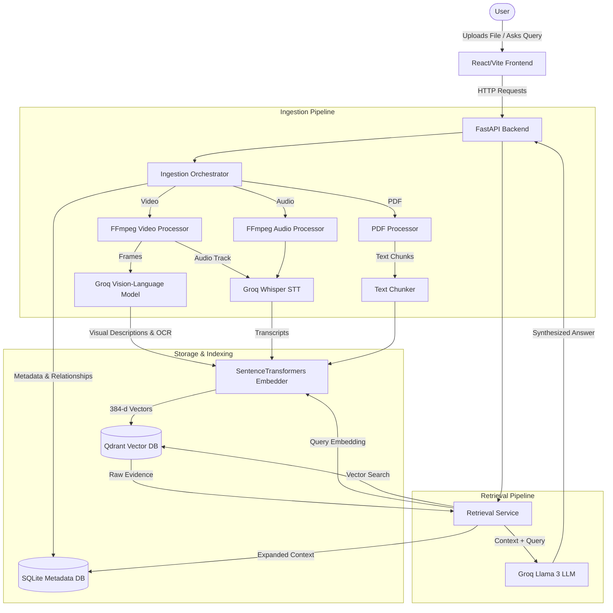

# Detailed Project Overview

## 1. What Problem We Are Solving

Organizations and students are drowning in multimedia data—video lectures, recorded meetings, podcasts, mixed-media presentations, and complex PDF reports containing diagrams. 

Ordinary text-only Retrieval-Augmented Generation (RAG) is insufficient for this use case because:
1. **It ignores visual context**: A standard RAG pipeline strips out diagrams and charts from a PDF, losing critical information.
2. **It ignores spoken word**: Videos and audio files contain valuable insights that text RAG cannot search.
3. **It loses temporal context**: If someone asks, "What was discussed when the architecture slide was on screen?", standard search fails because it cannot link spoken words to visual elements at specific timestamps.

Our Multimodal RAG solves this by seamlessly searching across text, audio, and visual data in a single unified system.

## 2. What Our Solution Does

In simple language: You can upload a PDF, a video, or an audio file into our chat application. The system "watches" the video, "listens" to the audio, and "reads" the PDF—including the diagrams. You can then ask a question like, *"What does the diagram on slide 4 say about the database?"* and the system will instantly find the exact frame of the video, read the diagram, synthesize an answer, and point you to the exact timestamp.

Technically: We orchestrate an ingestion pipeline that unifies unstructured multimodal data. We use FFmpeg to extract frames and audio from video. We use Whisper (STT) for transcription and a Vision-Language Model (VLM) for visual analysis and OCR. All extracted text, visual descriptions, and transcriptions are embedded using `sentence-transformers` and stored in Qdrant (a vector database). A FastAPI backend serves the React frontend, allowing complex semantic similarity queries that span across media types using metadata filtering and LLM synthesis.

## 3. Complete Architecture

## 4. Complete Data Flow

### A PDF is uploaded
1. The frontend POSTs the file to `/api/upload`.
2. The file is saved to `storage/uploads/`.
3. An ingestion thread parses the PDF, extracts text, and chunks it into manageable pieces (e.g., 1000 characters).
4. Each chunk is passed to `sentence-transformers` to generate a 384-dimensional vector embedding.
5. The vectors and metadata (page numbers, source IDs) are upserted into the Qdrant container.

### A video is uploaded
1. The video is saved to `storage/uploads/`.
2. FFmpeg extracts the audio track as an MP3 and samples keyframes based on visual scene changes.
3. The MP3 is sent to Groq's Whisper API for transcription.
4. The keyframes are sent to Groq's VLM to extract structured descriptions, OCR, and diagram layouts.
5. Both transcriptions and visual analyses are embedded and stored in Qdrant, with timestamps linking them relationally in SQLite.

### A question is asked
1. The frontend POSTs the query to `/api/query`.
2. The backend embeds the query text into a vector using the local `sentence-transformers` model.

### Retrieval happens
1. Qdrant performs a cosine-similarity search, finding the Top-K vectors closest to the query's vector.
2. The `RetrievalService` fetches the raw evidence and then queries SQLite to "expand" the context (e.g., fetching the video frame that occurred at the same timestamp as a retrieved spoken sentence).

### The final answer is generated
1. The expanded evidence is formatted into a massive text block.
2. The context and user query are sent to Groq's LLM (`llama-3.3-70b-versatile`).
3. The LLM generates an answer, synthesizing the cross-modal data, and cites the specific evidence IDs used.
4. The backend returns the answer and citation metadata to the frontend.

## 5. Multimodal RAG Explanation

* **Traditional RAG**: Only processes text. If a document has a picture of a graph, it is ignored.
* **Multimodal RAG**: Processes text, audio, and images into a shared semantic space.
* **Why embeddings are needed**: Computers can't compare the "meaning" of words easily. Embeddings convert concepts into coordinates in high-dimensional space so mathematically similar concepts are closer together.
* **Why Qdrant is needed**: To rapidly search millions of high-dimensional coordinates to find the "closest" match.
* **What the VLM contributes**: It translates pixels into semantic text descriptions and structured metadata (OCR, entities) so they can be embedded alongside normal text.
* **What STT contributes**: It translates spoken words into timestamps and text.
* **What the LLM contributes**: It reads all the retrieved text, visual descriptions, and transcripts, and writes a human-readable answer.
* **How text and visual information are connected**: Through temporal metadata. A visual frame at timestamp 01:23 is mathematically linked in SQLite to the spoken transcript from 01:20 to 01:25.

## 6. Why This Project Is Different

This is not a generic LangChain tutorial wrapper. 
- It handles **temporal relationship mapping** manually, meaning it actively links what is spoken to what is seen on screen at that exact moment.
- It uses a custom **structured VLM pipeline** that forces the Vision model to output rigid JSON containing specifically requested architectural elements (like "diagram_info" and "relationships"), preventing hallucinated noise from poisoning the vector database.

## 7. User Journey

1. The user opens the sleek React dashboard.
2. They drag-and-drop a recording of a 1-hour engineering meeting and a PDF of the architectural spec.
3. A progress bar tracks the complex background ingestion (FFmpeg -> Whisper -> VLM -> Embeddings -> Qdrant).
4. The UI dynamically suggests questions based on the uploaded content.
5. The user asks a complex question bridging both files.
6. The system streams back a synthesized answer, displaying clickable citations to exact timestamps and PDF pages.

## 8. Example

* **Upload:** A recorded lecture on Database Sharding and a PDF textbook chapter.
* **Query:** "When the professor was drawing the sharding diagram on the whiteboard, did he mention the same hash function as the textbook?"
* **Action:** Qdrant retrieves the VLM description of the whiteboard drawing (visual), the Whisper transcript of the professor speaking (audio), and the specific paragraph from the PDF (text).
* **Result:** The LLM synthesizes an answer directly comparing the visual drawing, the spoken lecture, and the written text, citing the specific video timestamp and PDF page.

## 9. Current Limitations

* **Brittle Background Tasks:** The system currently uses raw Python `threading` for ingestion. If the server restarts or crashes during a long video process, the job is lost and gets stuck in "Processing".
* **Third-Party Vision Dependency:** Groq frequently decommissions experimental Vision models, breaking the VLM pipeline unless gracefully handled via mocks or fallback providers.
* **Scalability:** In-memory threads limit how many videos can be processed simultaneously before the machine runs out of RAM.
